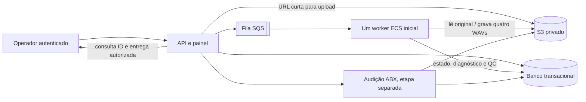

# Proposta de arquitetura AWS para o piloto

> Cenário histórico de arquivos de 30 segundos. O piloto local passou a admitir
> até 5 minutos/150 MB experimentalmente; dimensionamento e custo AWS para essa
> duração ainda dependem de benchmark.

**Status:** proposta técnica, sem decisão de serviços, região, implantação ou migração.
**Referência local:** `docs/CLOUD_READINESS_PLAN.md` e código em `motor_vocal/`.

**Revisão de menor estrutura para teste:** `docs/AWS_MINIMUM_TEST_PLAN.md`.

## Escopo confirmado e evidência

- O usuário confirmou até **50 áudios/dia**, **30 segundos por áudio** e até **cinco usuários enviando ao mesmo tempo**. Um worker é o ponto de partida; dez processamentos simultâneos são cenário de teste, não capacidade contratada. Não existe SLA de oito segundos.
- O pipeline local passou em MPS para um item de 30 segundos, inclusive pelo caminho de envio e fila, com quatro WAVs e QC aprovado. Isso não prevê o desempenho de CPU/CUDA nem o custo na AWS.
- O usuário informou que os cinco itens do corpus são de Antonio Barra e autorizou armazenamento/processamento internos na AWS. Não há confirmação de publicação ou compartilhamento públicos. O banco ABX local tinha zero sessões e zero votos na última inspeção documentada; a audição satisfatória foi relatada informalmente.
- **Hipótese para desenho, ainda não confirmada:** região `sa-east-1` (São Paulo), sujeita à resposta sobre residência de dados e à verificação de disponibilidade/preço dos recursos selecionados.

## Fluxo proposto

**Fronteiras:** o áudio entra no armazenamento de objetos; a mensagem da fila leva somente `job_id` e referência ao objeto, sem áudio ou credenciais. O banco guarda idempotência, estado, tentativa, identidade da build, referências aos artefatos e diagnóstico. O worker executa o atual `motor_vocal/pipeline.py` sem importar a interface. A API não executa Demucs.

## Serviços candidatos, ainda não aprovados

| Parte | Recomendação inicial | Verificação antes da escolha |
| --- | --- | --- |
| Upload e resultados | S3 privado, nomes por trabalho e URLs assinadas de curta duração. URLs assinadas permitem operações autorizadas até a expiração e dependem das permissões de quem assina ([AWS S3](https://docs.aws.amazon.com/AmazonS3/latest/userguide/using-presigned-url.html)). | Região, criptografia, controle de acesso, tamanho máximo, retenção e política para estímulos ABX. |
| Fila | SQS com fila de falhas e renovação da visibilidade durante o processamento. Uma mensagem pode ser entregue novamente; a conclusão deve ser idempotente pelo `job_id` e tentativa ([AWS SQS](https://docs.aws.amazon.com/AWSSimpleQueueService/latest/SQSDeveloperGuide/designing-for-outage-recovery-scenarios.html)). | Tempos medidos, número de tentativas e tratamento de falhas permanentes. |
| Execução | Avaliar primeiro um worker CPU em ECS/Fargate; comparar depois com ECS em EC2 GPU se a medição justificar. GPU não é recurso suportado em tarefas Fargate; ECS em instâncias EC2 pode reservar GPU ([AWS Fargate](https://docs.aws.amazon.com/AmazonECS/latest/developerguide/task_definition_parameters.html), [AWS ECS GPU](https://docs.aws.amazon.com/AmazonECS/latest/developerguide/ecs-gpu.html)). | Demucs no Linux/CUDA, memória, duração, disponibilidade regional e custo total. Não extrapolar os 6,30 s observados em MPS. |
| Estado e ABX | Banco transacional gerenciado a escolher. PostgreSQL é candidato por preservar melhor as relações, chave única por voto e transações atualmente implementadas em SQLite; exigirá adaptação e teste de migração, não mera troca de conexão. | Custo mínimo em repouso, autenticação, backup, acesso privado, esquema de jobs e semântica da audição. |
| Escala | Manter um worker no piloto. Se a fila justificar, medir backlog por tarefa antes de mudar capacidade; a AWS recomenda essa métrica para workers ECS ligados a SQS ([AWS ECS](https://docs.aws.amazon.com/AmazonECS/latest/developerguide/service-autoscaling-queue.html)). | Meta de espera na fila a ser definida após medição; não foi aprovado SLA de resposta. |

## Sequência segura de implementação

1. Fechar decisões de região, residência de dados, orçamento de teste, retenção e escopo da audição ABX na nuvem. Registrar a autorização dos cinco itens em fonte durável antes de transferi-los.
2. Criar uma imagem Linux reproduzível do worker e validar o modelo Demucs, FFmpeg, CPU e, se selecionado, CUDA. A build deve identificar dependências, modelo e código; evitar baixar o modelo durante cada trabalho.
3. Definir interfaces pequenas para fila, objetos e estado, mantendo `processing.py` e `pipeline.py` independentes de AWS. Testar o mesmo contrato v1 contra implementações locais e adaptadores.
4. Implementar a admissão de upload: autenticar operador, gerar referência privada, validar o arquivo real (tipo, duração até 30 s e integridade), reservar atomicamente a cota de 50 novos trabalhos no dia de São Paulo e enviar o `job_id` à fila.
5. Implementar worker idempotente: reclamar o trabalho, renovar visibilidade, gravar artefatos sob prefixo exclusivo por tentativa, verificar QC, concluir estado transacionalmente e só então confirmar a mensagem. Erros repetidos seguem para fila de falhas e inspeção.
6. Migrar sessões/votos ABX apenas após validar acesso público por token, separação entre verdade-terreno e participante, unicidade do voto, randomização e referências duráveis aos estímulos. Os dados atuais de audição não devem ser inventados ou copiados como votos formais.
7. Em ambiente de teste AWS, medir rajadas de **1, 5 e 10 envios** com um worker; depois medir **1, 5 e 10 processamentos paralelos** somente para dimensionamento. Registrar espera na fila, tempo de execução, falhas, CPU/memória/GPU, bytes armazenados e custo por áudio. A decisão de escala vem desses resultados.

## Retenção e segurança

- Não ativar expiração no S3 antes de aprovar prazo por classe de objeto: original, quatro resultados, estímulos ABX, diagnóstico e votos. Regras de S3 Lifecycle podem atingir objetos que já existiam quando são criadas ([AWS S3 Lifecycle](https://docs.aws.amazon.com/AmazonS3/latest/userguide/object-lifecycle-mgmt.html)).
- A inspeção local somente leitura em `motor_vocal/retention.py` permite estimar candidatos antigos com uma data de corte explícita. Ela não remove arquivos e não define prazo.
- Não colocar senha administrativa, credenciais AWS, URLs assinadas ou tokens de participantes em logs. O painel local ainda usa autenticação simples e precisa de desenho de acesso antes de exposição na internet.
- Separar permissões de API, worker e audição. O link público de audição deve dar acesso apenas à rodada, nunca ao banco, diagnóstico ou caminhos de objetos.

## Decisões abertas

1. Região/residência de dados: `sa-east-1` é hipótese, não escolha aprovada.
2. Retenção para cada tipo de áudio e para registros de audição; nenhum prazo foi aprovado.
3. Orçamento máximo do experimento AWS e tolerância de espera na fila; não há SLA de oito segundos.
4. Serviço de banco transacional e se a audição ABX entra no primeiro piloto cloud ou em etapa posterior.
5. CPU/Fargate ou GPU/EC2 somente após medição na região escolhida.

**Nenhum recurso AWS, imagem, migração, transferência de áudio ou política de exclusão foi criado por este documento.**
